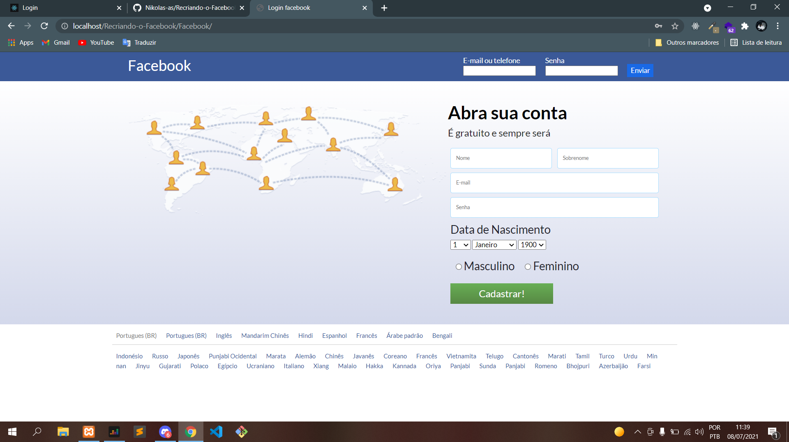

# Recriando o Facebook

<!---Esses são exemplos. Veja https://shields.io para outras pessoas ou para personalizar este conjunto de escudos. Você pode querer incluir dependências, status do projeto e informações de licença aqui--->




> Esse é um projeto que eu fiz a um bom tempo atrás pra treinar alguns conceitos básicos de html, php e css. É uma copia do facebook antigo ;)
> 
## Linguagens utilizadas

- [Css](https://developer.mozilla.org/pt-BR/docs/Web/CSS)
- [PHP](https://www.php.net/)
- [HTML](https://developer.mozilla.org/pt-BR/docs/Web/HTML)

## 🚀 Instalando Recriando o Facebook

Para instalar o Recriando o Facebook, siga estas etapas:

Linux e macOS:
```
git clone https://github.com/Nikolas-as/Recriando-o-Facebook.git

cd Facebook

npm start
```

Windows:
```
git clone https://github.com/Nikolas-as/Recriando-o-Facebook.git

cd Facebook

npm start
```

## 🤝 Colaboradores

Agradecemos às seguintes pessoas que contribuíram para este projeto:

<table>
  <tr>
    <td align="center">
      <a href="#">
        <br>
        <sub>
          <b>Nikão</b>
        </sub>
      </a>
    </td>
</table>
